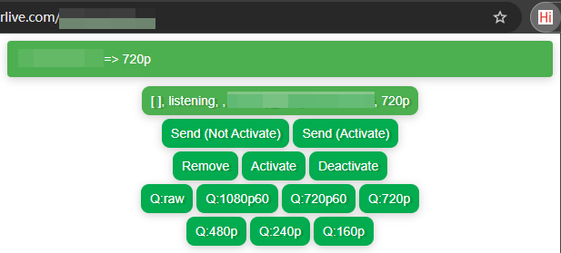
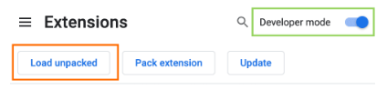
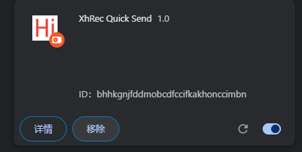
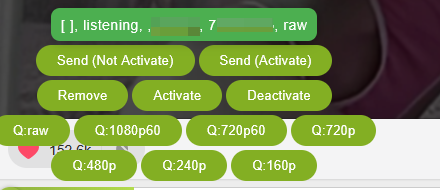

# XhREC

A kotlin application for automatic recording lives from StripChat.

## Usage

```plain
usage: 
 -f,--file <arg>     Room List File
 -post <arg>         Post Processor Config File (default: postprocessor.json)
 -o,--output <arg>   Output Dir
 -p,--port <arg>     Server Port [default:8090]
 -t,--tmp <arg>      Temp Dir
```

```shell
java -jar XhRec-all.jar -f list.conf -t /path/to/temp/folder -o /path/to/destnation/folder
```

### Post processing

Run processors one by one.

```json lines
{
  "default": [
    {
      "type": "fix_stamp",
      "output": "out"
    },
    {
      "type": "move",
      //{{ROOM_NAME}}                Model/Room name
      //{{ROOM_ID}}                  12345
      //{{RECORD_START}}             formated date time using "date_pattern"
      //{{RECORD_END}}               formated date time using "date_pattern"
      //{{RECORD_DURATION}}          90
      //{{RECORD_DURATION_STR}}      00h01m30s
      //{{INPUT}}                    /path/to/input/video/folder/a.mp4
      //{{INPUT_DIR}}                /path/to/input/video/folder
      //{{FILE_NAME}}                a.mp4
      //{{FILE_NAME_NOEXT}}          a
      //{{TOTAL_FRAMES}}             slow but accurate frame count
      //{{TOTAL_FRAMES_GUESS}}       FPS*Duration
      "dest": "out/[{{ROOM_ID}}]{{ROOM_NAME}}@{{RECORD_START}}-{{RECORD_END}} {{RECORD_DURATION_STR}}",
      "date_pattern": "yyyy年MM月dd日HH时mm分ss秒"
    },
    {
      "type": "slice",
      "duration": "1m10s"
    },
    // generate grid thumbnail (20x20, 400pic total)
    {
      "type": "shell",
      "noreturn": true,
      // default: true
      "remove_input": false,
       //{{ROOM_NAME}}                Model/Room name
       //{{ROOM_ID}}                  12345
       //{{RECORD_START}}             formated date time using "ISO_DATE_TIME" format
       //{{RECORD_END}}               formated date time using "ISO_DATE_TIME" format
       //{{RECORD_DURATION}}          90
       //{{RECORD_DURATION_STR}}      00h01m30s
       //{{INPUT}}                    /path/to/input/video/folder/a.mp4
       //{{INPUT_DIR}}                /path/to/input/video/folder
       //{{FILE_NAME}}                a.mp4
       //{{FILE_NAME_NOEXT}}          a
       //{{TOTAL_FRAMES}}             slow but accurate frame count
       //{{TOTAL_FRAMES_GUESS}}       FPS*Duration
      "args": [
        "ffmpeg",
        "-hide_banner",
        "-loglevel",
        "error",
        "-stats",
        "-i",
        "{{INPUT}}",
        "-vf",
        // if you change grid size, please recalculate total pic size
        // or replace '{{TOTAL_FRAMES_GUESS}}/400' to 50, which means every 50 frames will be one thumbnail
        "thumbnail={{TOTAL_FRAMES_GUESS}}/400,scale=200:-1,tile=20x20",
        "-vframes",
        "1",
        "{{INPUT_DIR}}\\{{FILE_NAME_NOEXT}}.thumb.png",
        "-y"
      ]
    }
  ]
}
```

## Control

There is only basic status page at `/` now. We provided a browser extension for quick control.

### Browser extension



1. Go to the Extensions page by entering `chrome://extensions` in a new tab. (By design `chrome://` URLs are not
   linkable.)

    - Alternatively, click the Extensions menu puzzle button and select **Manage Extensions** at the bottom of the menu.
    - Or, click the Chrome menu, hover over **More Tools**, then select **Extensions**.

2. Enable Developer Mode by clicking the toggle switch next to **Developer mode**.
3. Replace `docker.lan:8090` in `extension/popup.js` to your own server address.
4. Click the **Load unpacked** button and select the `extension` directory.
   
   

### API

#### /add

| Parameter | Description           |
|-----------|-----------------------|
| slug      | Room/Model name       |
| quality   | Quality, default 720p |
| active    | Start auto recording  |

#### /break

Temporary stop recording

| Parameter | Description     |
|-----------|-----------------|
| slug      | Room/Model name |

#### /remove

| Parameter | Description     |
|-----------|-----------------|
| slug      | Room/Model name |

#### /activate

| Parameter | Description     |
|-----------|-----------------|
| slug      | Room/Model name |

#### /deactivate

| Parameter | Description     |
|-----------|-----------------|
| slug      | Room/Model name |

#### /quality

| Parameter | Description     |
|-----------|-----------------|
| slug      | Room/Model name |
| quality   | Quality         |

#### /list (Deprecated)

Simple json status list

#### /status

Json status

```json lines
{
  "Model Name": {
    //total segments
    "total": 10046,
    //succeed segments
    "success": 9933,
    //failed segments
    "failed": 98,
    //total bytes
    "bytesWrite": 1409108341,
    //running segments
    "running": {
      "https://xxxx_part3.mp4": {
        // using PROXY
        "type": "PROXY",
        // start download time
        "startAt": 1756357723403
      },
      "https://xxxx_part1.mp4": {
        "type": "DIRECT",
        "startAt": 1756357716154
      }
    }
  }
}
```

#### /recorders

```json lines
[
  {
    "name": "Model Name",
    "id": 12345,
    "quality": "720p60",
     // record limit, PT2M means 2 minutes (ISO-8601 Duration format)
     // not recommand, may easily break you video.
    "limit": "PT2M",
    // useless for now
    "lastSeen": null
  }
]
```

#### /stop-server

Finish all recording tasks.
The server won't shut down for some reason, but it's safe to kill the process when this api responds.

#### /metrics

Prometheus metrics

You can build monitor like this:



## Configuration

```plain
# https://zh.xhamsterlive.com/modelA q:720p limit:120
; https://zh.xhamsterlive.com/modelB q:240p
https://zh.xhamsterlive.com/modelC q:raw
```

- Start with `#` or `;` will be marked as `INACTIVE`, means will not automatically start recording.
- limit:120 means record time (in seconds). **NOT RECOMMEND, MAY EASILY BREAK YOU VIDEO**.
- q:XXXX means preferred quality, raw means original quality.
  **_If not quality matches, program will select closest one._**
- `zh.` is optional, dont care about it.


## Logging

Custom logging: [https://github.com/RikaCelery/XhRec/issues/16](https://github.com/RikaCelery/XhRec/issues/16)

Logs will be saved to `./logs`.

Daily rename logs to `logs/xhrec.%d{yyyy-MM-dd}.log`.
