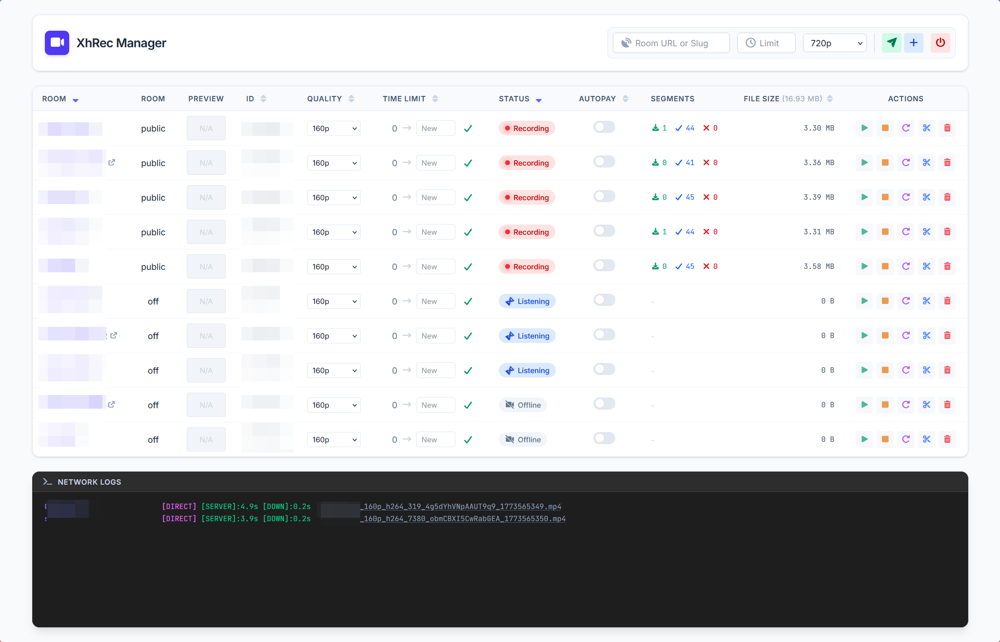

# XhREC

A kotlin application for automatic recording lives from StripChat.

## Usage

```plain
usage: 
 -f,--file <arg>     Room List File [default: list.conf]
 -post <arg>         Post Processor Config File [default: postprocessor.json]
 -o,--output <arg>   Output Dir [default: out]
 -p,--port <arg>     Server Port [default: 8090]
 -t,--tmp <arg>      Temp Dir [default: tmp]
```

```shell
java -jar XhRec-all.jar
```
```shell
java -jar XhRec-all.jar -p 12340 -f list.conf -post postprocessor.json -t /path/to/temp/folder -o /path/to/destnation/folder
```

## Control

### WebUI

`http://localhost:8090`


### Browser extension


1. Go to the Extensions page by entering `chrome://extensions` in a new tab. (By design `chrome://` URLs are not
   linkable.)

    - Alternatively, click the Extensions menu puzzle button and select **Manage Extensions** at the bottom of the menu.
    - Or, click the Chrome menu, hover over **More Tools**, then select **Extensions**.

2. Enable Developer Mode by clicking the toggle switch next to **Developer mode**.
3. Replace `docker.lan:8090` in `extension/popup.js` to your own server address.
4. Click the **Load unpacked** button and select the `extension` directory.
   
   

## Configuration

```plain
# https://zh.xhamsterlive.com/modelA q:720p limit:120 sizelimit:500
; https://zh.xhamsterlive.com/modelB q:240p
https://zh.xhamsterlive.com/modelC q:raw
```

- Start with `#` or `;` will be marked as `INACTIVE`, means will not automatically start recording.
- `limit:120` means record time limit (in seconds). When reached, the file will be split.
- `sizelimit:500` means record file size limit (in MB). When reached, the file will be split.
- `q:XXXX` means preferred quality, `raw` means original quality.
  **_If no quality matches, program will select closest one._**
- `zh.` is optional, dont care about it.

## Post processing

Run processors one by one.

### Available Processors

#### cleanup
Delete files that are too short or too small. Useful for cleaning up fragmented recordings.

| Parameter | Description |
|-----------|-------------|
| min_duration_seconds | Minimum duration in seconds. Files shorter than this will be deleted. |
| min_size_mb | Minimum file size in MB. Files smaller than this will be deleted. |

**Note**: The two conditions are OR relationship - file will be deleted if **either** condition is met.

```json
{
  "type": "cleanup",
  "min_duration_seconds": 10,
  "min_size_mb": 10
}
```

#### fix_stamp
Fix video timestamps using ffmpeg. This is usually needed for fMP4 recordings.

| Parameter | Description |
|-----------|-------------|
| output | Output directory for fixed files |

```json
{
  "type": "fix_stamp",
  "output": "out"
}
```

#### move
Move/rename files with pattern support.

| Parameter | Description |
|-----------|-------------|
| dest | Destination path pattern |
| date_pattern | Date format pattern for `{{RECORD_START}}` and `{{RECORD_END}}` |

**Available variables:**
- `{{ROOM_NAME}}` - Model/Room name
- `{{ROOM_ID}}` - Room ID (e.g., 12345)
- `{{RECORD_START}}` - Formatted date time using "date_pattern"
- `{{RECORD_END}}` - Formatted date time using "date_pattern"
- `{{RECORD_DURATION}}` - Duration in milliseconds (e.g., 90000)
- `{{RECORD_DURATION_STR}}` - Formatted duration (e.g., 00h01m30s)
- `{{INPUT}}` - Full input file path
- `{{INPUT_DIR}}` - Input file directory
- `{{FILE_NAME}}` - Input file name with extension
- `{{FILE_NAME_NOEXT}}` - Input file name without extension
- `{{TOTAL_FRAMES}}` - Accurate frame count (slow)
- `{{TOTAL_FRAMES_GUESS}}` - Estimated frame count (FPS × Duration)

```json
{
  "type": "move",
  "dest": "out/[{{ROOM_ID}}]{{ROOM_NAME}}@{{RECORD_START}}-{{RECORD_END}} {{RECORD_DURATION_STR}}",
  "date_pattern": "yyyy年MM月dd日HH时mm分ss秒"
}
```

#### slice
Split video into multiple parts by duration.

| Parameter | Description |
|-----------|-------------|
| duration | Duration of each slice (ISO-8601 format, e.g., "1m10s", "PT1H") |

```json
{
  "type": "slice",
  "duration": "1m10s"
}
```

#### shell
Run custom shell command.

| Parameter | Description |
|-----------|-------------|
| args | Command arguments array |
| noreturn | If true, return input file; if false, read output path from stdout (default: true) |
| remove_input | Remove input file after processing (default: false) |

**Available variables:** Same as `move` processor, but `{{RECORD_START}}` and `{{RECORD_END}}` use ISO_DATE_TIME format.

### Example Configuration

```json lines
{
  "default": [
    // First, clean up small/short files
    {
      "type": "cleanup",
      "min_duration_seconds": 10,
      "min_size_mb": 10
    },
    {
      "type": "fix_stamp",
      "output": "out"
    },
    {
      "type": "move",
      "dest": "out/[{{ROOM_ID}}]{{ROOM_NAME}}@{{RECORD_START}}-{{RECORD_END}} {{RECORD_DURATION_STR}}",
      "date_pattern": "yyyy年MM月dd日HH时mm分ss秒"
    },
    {
      "type": "slice",
      "duration": "1m10s"
    },
    // generate grid thumbnail (20x20, 400pic total)
    {
      "type": "shell",
      "noreturn": true,
      "remove_input": false,
      "args": [
        "ffmpeg",
        "-hide_banner",
        "-loglevel",
        "error",
        "-stats",
        "-i",
        "{{INPUT}}",
        "-vf",
        "thumbnail={{TOTAL_FRAMES_GUESS}}/400,scale=200:-1,tile=20x20",
        "-vframes",
        "1",
        "{{INPUT_DIR}}\\{{FILE_NAME_NOEXT}}.thumb.png",
        "-y"
      ]
    }
  ]
}
```

## API

#### /add

| Parameter | Description           |
|-----------|-----------------------|
| slug      | Room/Model name       |
| quality   | Quality, default 720p |
| active    | Start auto recording  |

#### /break

Temporary stop recording

| Parameter | Description     |
|-----------|-----------------|
| slug      | Room/Model name |

#### /remove

| Parameter | Description     |
|-----------|-----------------|
| slug      | Room/Model name |

#### /activate

| Parameter | Description     |
|-----------|-----------------|
| slug      | Room/Model name |

#### /deactivate

| Parameter | Description     |
|-----------|-----------------|
| slug      | Room/Model name |

#### /quality

| Parameter | Description     |
|-----------|-----------------|
| slug      | Room/Model name |
| quality   | Quality         |

#### /limit

Set recording time limit for a room.

| Parameter | Description                              |
|-----------|------------------------------------------|
| slug      | Room/Model name                          |
| limit     | Time limit in seconds (0 = no limit)     |

#### /list (Deprecated)

Simple json status list

#### /status

Json status

```json lines
{
  "Model Name": {
    //total segments
    "total": 10046,
    //succeed segments
    "success": 9933,
    //failed segments
    "failed": 98,
    //total bytes
    "bytesWrite": 1409108341,
    //running segments
    "running": {
      "https://xxxx_part3.mp4": {
        // using PROXY
        "type": "PROXY",
        // start download time
        "startAt": 1756357723403
      },
      "https://xxxx_part1.mp4": {
        "type": "DIRECT",
        "startAt": 1756357716154
      }
    }
  }
}
```

#### /recorders

```json lines
[
  {
    "name": "Model Name",
    "id": 12345,
    "quality": "720p60",
    // record time limit, PT2M means 2 minutes (ISO-8601 Duration format)
    // triggers file split when reached
    "limit": "PT2M",
    // record file size limit in MB
    // triggers file split when reached (0 = no limit)
    "sizeLimit": 500,
    // useless for now
    "lastSeen": null
  }
]
```

#### /stop-server

Finish all recording tasks.
The server won't shut down for some reason, but it's safe to kill the process when this api responds.

#### /metrics

Prometheus metrics

You can build monitor like this:


## Logging

Custom logging: [https://github.com/RikaCelery/XhRec/issues/16](https://github.com/RikaCelery/XhRec/issues/16)

Logs will be saved to `./logs`.

Daily rename logs to `logs/xhrec.%d{yyyy-MM-dd}.log`.
