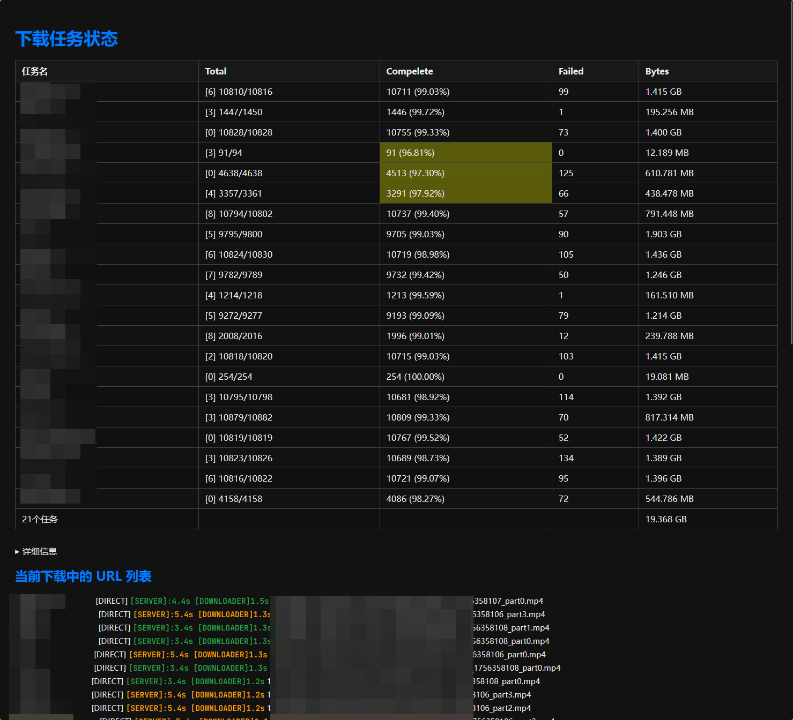

# XhREC

A kotlin application for automatic recording lives from StripChat.

## Usage

```plain
usage: CommandLineParameters
 -f,--file <arg>     Room List File
 -o,--output <arg>   Output Dir
 -p,--port <arg>     Server Port [default:8090]
 -t,--tmp <arg>      Temp Dir
```

```shell
java -jar XhRec-all.jar -f list.conf -t /path/to/temp/folder -o /path/to/destnation/folder
```

## Control

There is no builtin GUI/CLI for now. But we provided a html for preview and a browser extension for quick control.

### API

#### /add

| Parameter | Description           |
| --------- | --------------------- |
| slug      | Room/Model name       |
| quality   | Quality, default 720p |
| active    | Start auto recording  |

#### /break

Temporary stop recording

| Parameter | Description     |
| --------- | --------------- |
| slug      | Room/Model name |

#### /remove

| Parameter | Description     |
| --------- | --------------- |
| slug      | Room/Model name |

#### /activate

| Parameter | Description     |
| --------- | --------------- |
| slug      | Room/Model name |

#### /deactivate

| Parameter | Description     |
| --------- | --------------- |
| slug      | Room/Model name |

#### /quality

| Parameter | Description     |
| --------- | --------------- |
| slug      | Room/Model name |
| quality   | Quality         |

#### /list (Deprecated)

Simple json status list

##$# /status

Json status

```json lines
{
  "Model Name": {
    //total segments
    "total": 10046,
    //succeed segments
    "success": 9933,
    //failed segments
    "failed": 98,
    //total bytes
    "bytesWrite": 1409108341,
    //running segments
    "running": {
      "https://xxxx_part3.mp4": {
        // using PROXY
        "type": "PROXY",
        // start download time
        "startAt": 1756357723403
      },
      "https://xxxx_part1.mp4": {
        "type": "DIRECT",
        "startAt": 1756357716154
      }
    }
  }
}
```

#### /recorders

```json lines
[
  {
    "name": "Model Name",
    "id": 12345,
    "quality": "720p60",
    // useless for now
    "lastSeen": null
  }
]
```

#### /stop-server

Finish all recording tasks.
The server won't shut down for some reason, but it's safe to kill the process when this api responds.

#### /metrics

Prometheus metrics

You can build monitor like this:


## Configuration

```plain
# https://zh.xhamsterlive.com/modelA q:720p
; https://zh.xhamsterlive.com/modelB q:240p
https://zh.xhamsterlive.com/modelC q:raw
```

- Start with `#` or `;` will be marked as `INACTIVE`, means will not automatically start recording
- q:XXXX means preferred quality, raw means original quality.
  **_If not quality matches, program will select closest one._**
- `zh.` is optional, dont care about it.

## UI

### HTML



```html
<!DOCTYPE html>
<html lang="zh">
  <head>
    <meta charset="UTF-8" />
    <link rel="preconnect" href="https://fonts.googleapis.com" />
    <link rel="preconnect" href="https://fonts.gstatic.com" crossorigin />
    <link
      href="https://fonts.googleapis.com/css2?family=JetBrains+Mono:ital,wght@0,100..800;1,100..800&display=swap"
      rel="stylesheet"
    />
    <title>任务状态监控</title>
    <style>
      :root {
        --bg-color-light: #ffffff;
        --text-color-light: #000000;
        --bg-color-dark: #121212;
        --text-color-dark: #eeeeee;
        --table-border: #444;
        --highlight-blue: #007bff;
        --highlight-green: #28a745;
        --highlight-orange: orange;
        --highlight-red: red;
        --highlight-yellow: gold;
      }

      span {
        font-family: "JetBrains Mono", monospace;
        font-weight: 500;
        font-style: normal;
      }

      @media (prefers-color-scheme: dark) {
        body {
          background-color: var(--bg-color-dark);
          color: var(--text-color-dark);
        }

        table {
          border-color: var(--table-border);
        }
      }

      @media (prefers-color-scheme: light) {
        body {
          background-color: var(--bg-color-light);
          color: var(--text-color-light);
        }

        table {
          border-color: var(--table-border);
        }
      }

      body {
        font-family: sans-serif;
        padding: 20px;
      }

      h1,
      h2 {
        color: var(--highlight-blue);
      }

      table {
        width: 100%;
        border-collapse: collapse;
        margin-bottom: 30px;
      }

      th,
      td {
        border: 1px solid var(--table-border);
        padding: 8px 12px;
        text-align: left;
      }

      th {
        background-color: #33333333;
      }

      tr:nth-child(even) {
        background-color: #00000022;
      }

      .proxy {
        color: var(--highlight-yellow);
      }

      .time-short {
        color: var(--highlight-green);
      }

      .time-medium {
        color: var(--highlight-orange);
      }

      .time-long {
        color: var(--highlight-red);
        font-weight: bold;
      }

      .url-list {
        margin-top: 20px;
      }

      .url-item {
        font-size: 0.9rem;
        margin-bottom: 4px;
      }

      iframe {
        width: 100%;
        min-height: 70vh;
      }

      .abnormal {
        background: #ffff004f;
      }
    </style>
  </head>
  <body>
    <h1>下载任务状态</h1>
    <table id="summary-table">
      <thead>
        <tr>
          <th>任务名</th>
          <th>Total</th>
          <th>Compelete</th>
          <th>Failed</th>
          <th>Bytes</th>
        </tr>
      </thead>
      <tbody></tbody>
    </table>
    <details>
      <iframe src="/preview"></iframe>
    </details>
    <div class="url-list">
      <h2>当前下载中的 URL 列表</h2>
      <div id="url-items">加载中...</div>
    </div>

    <script>
      function formatBytes(bytes) {
        const units = ["B", "KB", "MB", "GB"];
        let i = 0;
        while (bytes >= 1024 && i < units.length - 1) {
          bytes /= 1024;
          i++;
        }
        return `${bytes.toFixed(3)} ${units[i]}`;
      }

      async function fetchStatus() {
        try {
          // REPLACE TO YOUR OWN API SERVER
          // REPLACE TO YOUR OWN API SERVER
          // REPLACE TO YOUR OWN API SERVER
          // REPLACE TO YOUR OWN API SERVER
          // REPLACE TO YOUR OWN API SERVER
          // REPLACE TO YOUR OWN API SERVER
          const res = await fetch("http://localhost:8090/status");
          const data = await res.json();

          const tableBody = document.querySelector("#summary-table tbody");
          const urlContainer = document.getElementById("url-items");
          const now = Date.now();

          tableBody.innerHTML = "";
          urlContainer.innerHTML = "";

          const allUrls = [];
          const MAXLEN = 20;
          let allBytes = 0;
          Object.entries(data).forEach(([taskName, taskInfo]) => {
            if (taskInfo.bytesWrite < 0) taskInfo.bytesWrite += 2147483647 * 2;
            allBytes += taskInfo.bytesWrite;
            const row = document.createElement("tr");
            const compelete = taskInfo.success + taskInfo.failed;
            const normal_rate = (taskInfo.success * 100.0) / taskInfo.total;
            row.innerHTML = `
            <td>${taskName.slice(0, MAXLEN)}</td>
   <td>[${taskInfo.total - compelete}] ${compelete}/${taskInfo.total}</td>
   <td class="${normal_rate < 98 ? "abnormal" : ""}">${
              taskInfo.success
            } (${normal_rate.toFixed(2)}%)</td>
            <td>${taskInfo.failed}</td>
            <td>${formatBytes(taskInfo.bytesWrite || 0)}</td>
          `;
            tableBody.appendChild(row);
            const running = taskInfo.running || {};

            const entries = Object.entries(running).map(([url, meta]) => {
              meta.startAtAbs = /_(\d+)_part.\.mp4/.exec(url)[1] * 1000;
              return [url, meta];
            });
            entries.forEach(([url, meta]) => {
              const elapsed = ((now - meta.startAt) / 1000).toFixed(1);

              const elapsedAbs = ((now - meta.startAtAbs) / 1000).toFixed(1);
              let timeClass = "time-short";
              if (elapsedAbs > 10) {
                timeClass = "time-long";
              } else if (elapsedAbs > 5) {
                timeClass = "time-medium";
              }

              const urlDiv = document.createElement("div");
              urlDiv.className = "url-item";
              if (meta.type === "PROXY") urlDiv.classList.add("proxy");
              urlDiv.innerHTML = `${(
                taskName + "                                "
              )
                .slice(0, MAXLEN)
                .replaceAll(" ", "&ensp;")} [${
                meta.type
              }] <span class="${timeClass}">[SERVER]:${elapsedAbs}s [DOWNLOADER]${elapsed}s</span> ${
                url.split("/").slice(-1)[0]
              }`;
              allUrls.push({ meta: meta, el: urlDiv });
            });
          });

          const row = document.createElement("tr");
          row.innerHTML = `
     <td>${Object.keys(data).length}个任务</td>
   <td></td>
   <td></td>
            <td></td>
            <td>${formatBytes(allBytes || 0)}</td>
          `;
          tableBody.appendChild(row);
          if (allUrls.length > 0) {
            allUrls.sort((a, b) => {
              let offseta = 0;
              let offsetb = 0;
              if (a.meta.type == "PROXY") offseta = -15000;
              if (b.meta.type == "PROXY") offsetb = -15000;
              //console.log(a.meta.type)
              return a.meta.startAt + offseta - b.meta.startAt - offsetb;
            });
            allUrls.forEach((div) => urlContainer.appendChild(div.el));
          } else {
            urlContainer.textContent = "无下载任务";
          }
        } catch (e) {
          document.getElementById("url-items").textContent = "获取失败: " + e;
        }
      }

      fetchStatus();
      setInterval(fetchStatus, 500);
    </script>
  </body>
</html>
```

### Browser extension


1. Go to the Extensions page by entering `chrome://extensions` in a new tab. (By design `chrome://` URLs are not linkable.)

    - Alternatively, click the Extensions menu puzzle button and select **Manage Extensions** at the bottom of the menu.
    - Or, click the Chrome menu, hover over **More Tools**, then select **Extensions**.

2. Enable Developer Mode by clicking the toggle switch next to **Developer mode**.
3. Click the **Load unpacked** button and select the `extension` directory.

