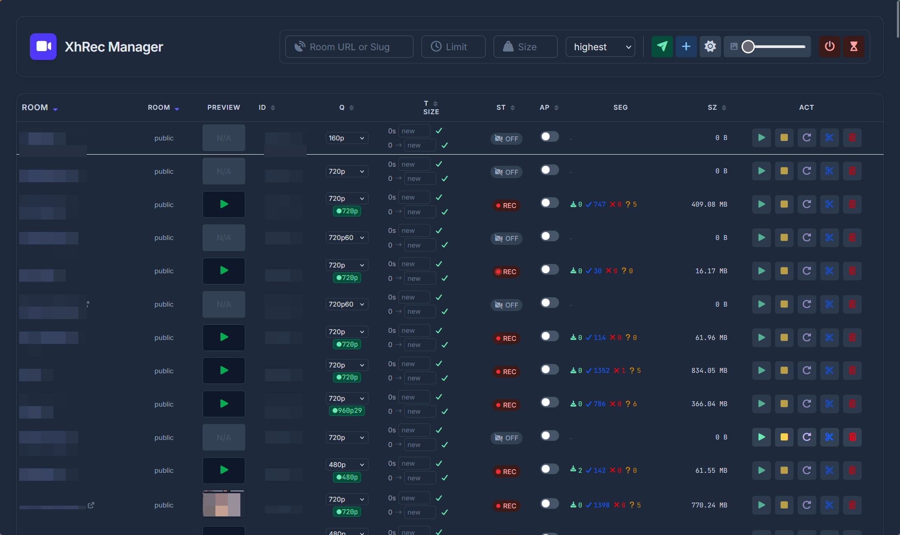
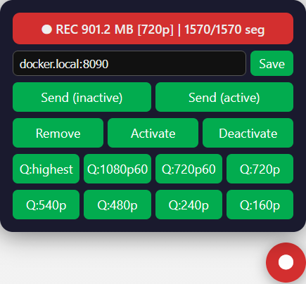
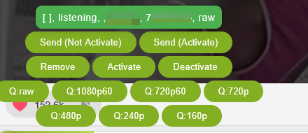

# XhREC

[简体中文](README_zh-CN.md)

Kotlin application for automatic live stream recording, with a browser extension for one-click control.

## Quick Start

```shell
./gradlew build
java -jar build/libs/XhRec-all.jar
```

Then open `https://localhost:8090` for the dashboard.

## CLI Options

| Option | Description | Default |
|---|---|---|
| `-f`, `--file` | Room list config | `list.conf` |
| `-o`, `--output` | Output directory | `out` |
| `-t`, `--tmp` | Temp directory | `tmp` |
| `-p`, `--port` | HTTP server port | `8090` |
| `-u`, `--users` | Users file | `users.txt` |
| `-post` | Post processor config | `postprocessor.json` |

```shell
java -jar build/libs/XhRec-all.jar -p 12340 -f list.conf -post postprocessor.json -t /tmp/xhrec -o /out
```

## Configuration

### list.conf

One room per line. Lines starting with `#` or `;` are inactive (not automatically recorded).

```ini
# https://stripchat.com/modelA q:720p limit:120
; https://stripchat.com/modelB q:240p
https://stripchat.com/modelC q:highest
```

| Field | Description |
|---|---|
| `q:<quality>` | Preferred quality: `240p`, `480p`, `720p`, `720p60`, `1080p`, `1080p60`, or `highest` (default). `raw` is deprecated, use `highest` instead |
| `limit:<sec>` | Recording time limit in seconds |
| `size:<bytes>` | Recording size limit (supports suffixes: `K`, `M`, `G`, e.g. `500M`) |
| `autopay` | Enable auto-payment for private shows |
| `pkey:<key>` | Custom psch key |

If the requested quality is unavailable, the closest match is selected automatically.

### xhrec.json

Stream decryption key store. Created with defaults on first run if absent.

```json
{
  "streamAuthKey": "default psch key, if failed to extract from master playlist",
  "decryptKeys": {
    "psch key 1": "decrypt key",
    "psch key 2": "decrypt key"
  }
}
```

| Field | Description |
|---|---|
| `streamAuthKey` | Default key psch key for stream auth |
| `decryptKeys` | Key-value map of decryption keys (psch key → key) |

### users.txt

User cookies for auto-payment. One cookie per line. Lines starting with `#` or `;` are ignored.

Each cookie is validated against the platform API on startup to resolve the user's ID, name, and coin balance. When a private show requires payment, the system selects a user with sufficient coins.

```
# optional comments
cookie_string_here
```

## WebUI & Browser Extension

### Dashboard

`https://localhost:8090` — manage rooms, view live status, and control recordings.



### UserScript

[install](https://greasyfork.org/zh-CN/scripts/582444-xhrec-control-panel)


## API Reference

All endpoints return JSON unless noted. Parameters are passed as query strings.

### Room Management

| Endpoint | Params | Description |
|---|---|---|
| `/add` | `name`, `quality`, `active`, `limit`, `autopay`, `pkey`, `size` | Add a room |
| `/remove` | `id` | Remove a room |
| `/start` | `id` | Start recording |
| `/stop` | `id` | Stop recording |
| `/restart` | `id` | Stop then restart recording |
| `/break` | `id` | Temporary stop (resumes on next poll) |

### Room Settings

| Endpoint | Params | Description |
|---|---|---|
| `/activate` | `id` | Enable auto-recording |
| `/deactivate` | `id` | Disable auto-recording |
| `/quality` | `id`, `q` | Set quality |
| `/autopay` | `id`, `v` (true/false) | Toggle auto-payment |
| `/limit` | `id`, `v` (seconds) | Set time limit (0 = unlimited) |
| `/sizelimit` | `id`, `v` | Set size limit (0 = unlimited) |

### Status & Monitoring

| Endpoint | Description |
|---|---|
| `/status` | Active room status (segments, bytes, running downloads) |
| `/list` | All rooms with status, session state, quality |
| `/dashboard` | Consolidated payload: rooms, statuses, listv2, metrics |
| `/metrics` | Prometheus metrics endpoint |

### Live Preview

| Endpoint | Params | Description |
|---|---|---|
| `/mse/live` | `id` | MP4 stream of in-progress recording |

### Server Control

| Endpoint | Description |
|---|---|
| `/graceful-stop` | Finish recordings and shut down |
| `/stop-server` | Finish recordings and post-processing, then exit |

### Status Response Format

```json
{
  "Model Name": {
    "total": 10046,
    "success": 9933,
    "failed": 98,
    "bytesWrite": 1409108341,
    "running": {
      "https://...part3.mp4": {
        "type": "PROXY",
        "startAt": 1756357723403
      }
    }
  }
}
```

## Post Processing

Defined in `postprocessor.json`. Processors run in sequence after a recording finishes.

### Built-in Processors

| Type | Description |
|---|---|
| `fix_stamp` | Fix MP4 timestamps |
| `move` | Move/rename output files |
| `slice` | Split video into segments |
| `shell` | Run arbitrary shell commands |

### Template Variables

Available in `move` destinations and `shell` arguments:

| Variable | Description |
|---|---|
| `{{ROOM_NAME}}` | Model/room name |
| `{{ROOM_ID}}` | Room ID |
| `{{RECORD_START}}` | Formatted start time |
| `{{RECORD_END}}` | Formatted end time |
| `{{RECORD_DURATION}}` | Duration in seconds |
| `{{RECORD_DURATION_STR}}` | Duration as `00h01m30s` |
| `{{RECORD_QUALITY}}` | Quality string |
| `{{INPUT_ABS}}` | Input file path |
| `{{INPUT_DIR}}` | Input directory |
| `{{INPUT_NAME}}` | Input filename |
| `{{INPUT_NAME_NOEXT}}` | Filename without extension |
| `{{TOTAL_FRAMES}}` | Accurate frame count |
| `{{TOTAL_FRAMES_GUESS}}` | Estimated frame count (FPS × duration) |

### Example Configuration

```json
{
  "default": [
    { "type": "fix_stamp", "output": "out" },
    {
      "type": "move",
      "output": "out/[{{ROOM_ID}}]{{ROOM_NAME}}@{{RECORD_START}}-{{RECORD_END}} {{RECORD_DURATION_STR}}",
      "date_pattern": "yyyy-MM-dd HH:mm:ss"
    },
    { "type": "slice", "output": "out", "duration": "1m10s" },
    {
      "type": "shell",
      "noreturn": true,
      "remove_input": false,
      "date_pattern": "yyyy-MM-dd_HH-mm-ss",
      "cmd": [
        "ffmpeg", "-hide_banner", "-loglevel", "error", "-stats",
        "-i", "{{INPUT_ABS}}",
        "-vf", "thumbnail={{TOTAL_FRAMES_GUESS}}/400,scale=200:-1,tile=20x20",
        "-vframes", "1",
        "{{INPUT_DIR}}/{{INPUT_NAME_NOEXT}}.thumb.png",
        "-y"
      ]
    }
  ]
}
```

## Logging & Monitoring

Logs are written to `./logs` with daily rotation (`xhrec.yyyy-MM-dd.log`).

Prometheus metrics are exposed at `/metrics`. Example Grafana dashboard:


